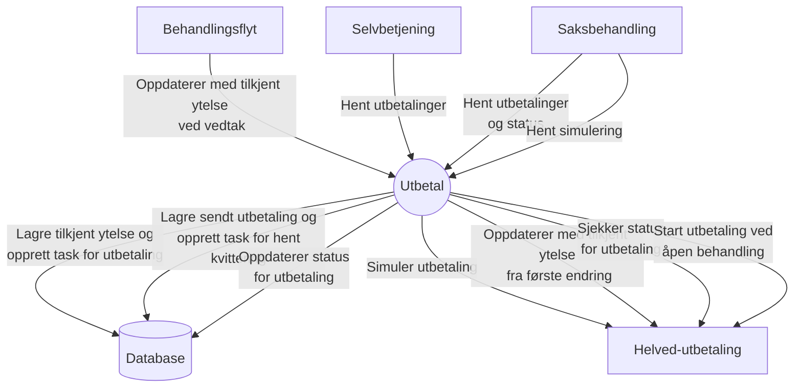
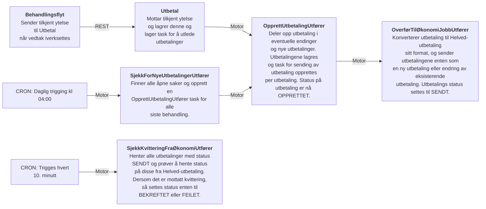
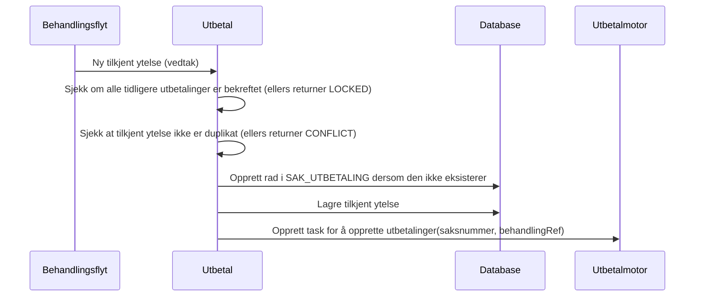
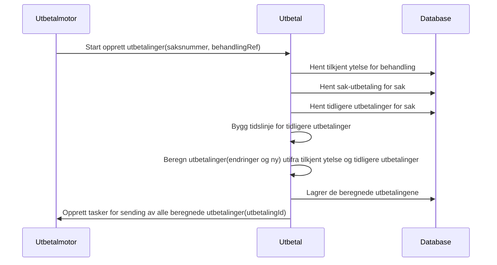
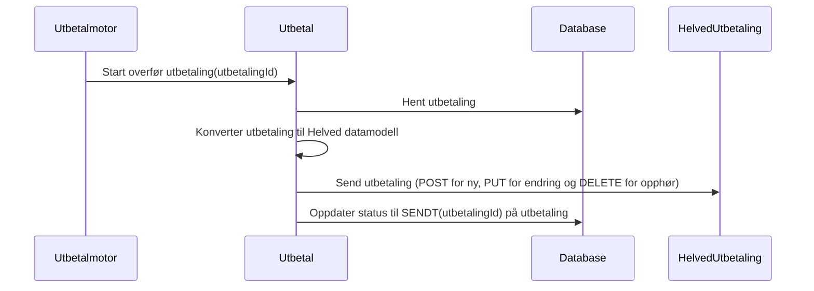
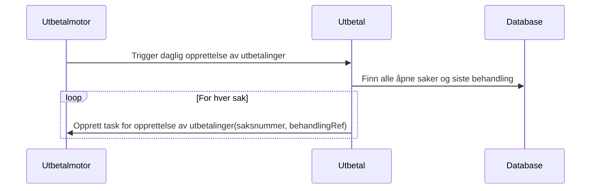
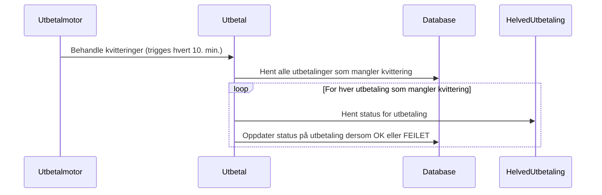

# aap-utbetal

Applikasjon som sørger for at tilkjent ytelse fra behandlingsflyt blir omgjort til utbetalinger som sendt til oppdrag via helved-utbetaling.

### API-dokumentasjon

APIene er dokumentert med Swagger.
* Lokalt: http://localhost:8080/swagger-ui/index.html
* Testmiljø: https://aap-utbetal.intern.dev.nav.no/swagger-ui/index.html

### Kontekstdiagram

### Flyt

### Hovedfunksjoner

#### #1: Mottar tilkjent ytelse fra behandlingsflyt ved veedtak

#### #2: Opprett utbetalinger for gitt behandling/tilkjent ytelse

#### #3: Overfør utbetaling til Helved-utbetaling

#### #4: Finn nye utbetalinger som skal overføres

#### #5: Behandle kvittering

### Lokalt utviklingsmiljø:

Applikasjonen aap-utbetal bruker test-containers for integrasjonstest med databasen.
En Docker-container er derfor nødvendig.
For macOS og Linux anbefaler vi Colima. Det kan være nødvendig med et par tilpasninger:

* `export TESTCONTAINERS_DOCKER_SOCKET_OVERRIDE=$HOME/.colima/docker.sock`
* `export DOCKER_HOST=unix://$TESTCONTAINERS_DOCKER_SOCKET_OVERRIDE`
* `export TESTCONTAINERS_RYUK_DISABLED=true`
