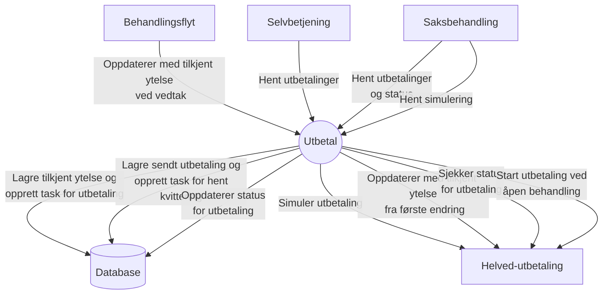
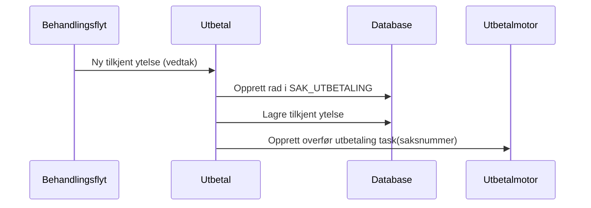
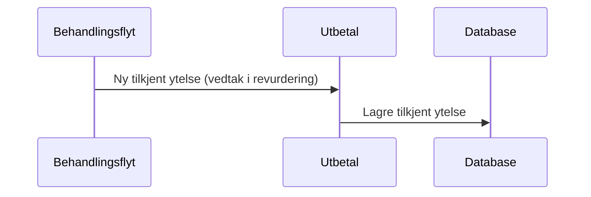
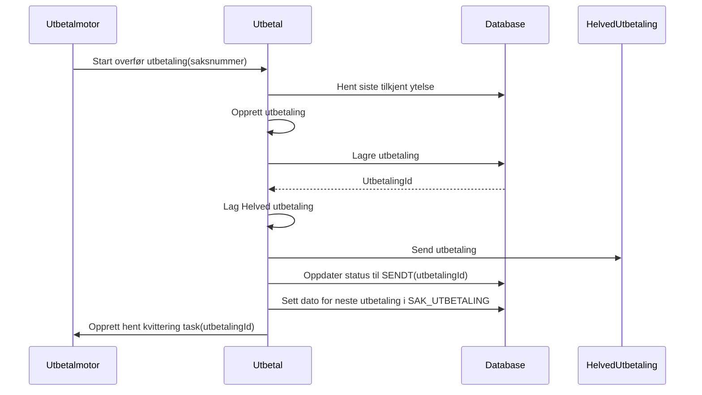
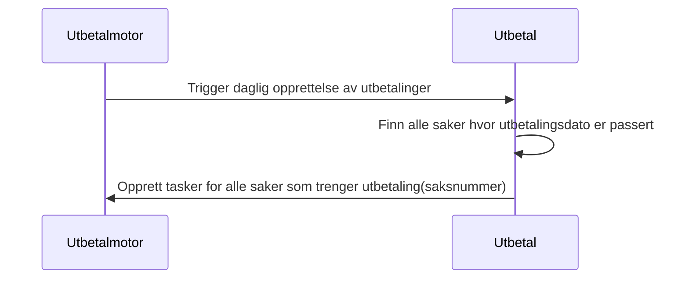
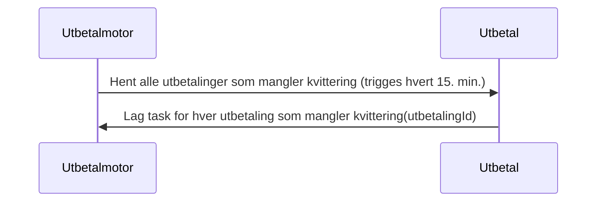
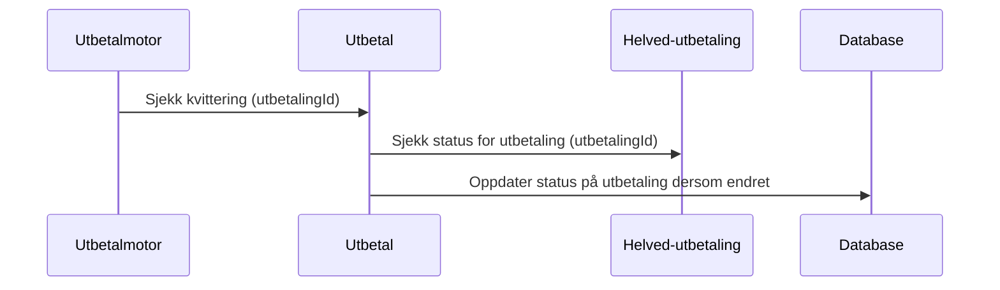

# aap-utbetal

Applikasjon som sørger for at tilkjent ytelse fra behandlingsflyt blir omgjort til utbetalinger som sendt til oppdrag via helved-utbetaling.

### API-dokumentasjon

APIene er dokumentert med Swagger: http://localhost:8080/swagger-ui/index.html

### Kontekstdiagram

### Scenarioer

#### Scenario #1: Vedtak på førstegangsbehandling

#### Scenario #2: Vedtak på revurdering

#### Scenario #3: Overfør utbetaling til Helved-utbetaling

#### Scenario #4: Finn nye utbetalinger som skal overføres

#### Scenario #5: Behandle kvittering

#### Scenario #6: Hent kvitteringer for utbetaling og oppdater database

### Lokalt utviklingsmiljø:

Applikasjonen aap-utbetal bruker test-containers for integrasjonstest med databasen.
En Docker-container er derfor nødvendig.
For macOS og Linux anbefaler vi Colima. Det kan være nødvendig med et par tilpasninger:

* `export TESTCONTAINERS_DOCKER_SOCKET_OVERRIDE=$HOME/.colima/docker.sock`
* `export DOCKER_HOST=unix://$TESTCONTAINERS_DOCKER_SOCKET_OVERRIDE`
* `export TESTCONTAINERS_RYUK_DISABLED=true`
