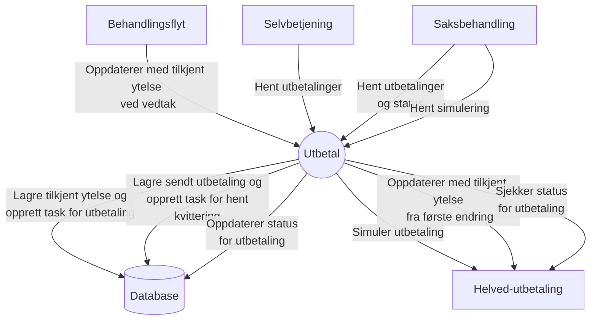

# aap-utbetal

### API-dokumentasjon

APIene er dokumentert med Swagger: http://localhost:8080/swagger-ui/index.html

### Kontekstdiagram

### Lokalt utviklingsmiljø:

Applikasjonen aap-utbetal bruker test-containers for integrasjonstest med databasen.
En Docker-container er derfor nødvendig.
For macOS og Linux anbefaler vi Colima. Det kan være nødvendig med et par tilpasninger:

* `export TESTCONTAINERS_DOCKER_SOCKET_OVERRIDE=$HOME/.colima/docker.sock`
* `export DOCKER_HOST=unix://$TESTCONTAINERS_DOCKER_SOCKET_OVERRIDE`
* `export TESTCONTAINERS_RYUK_DISABLED=true`
